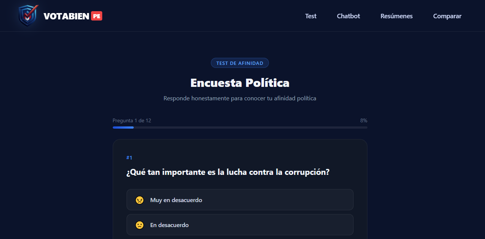
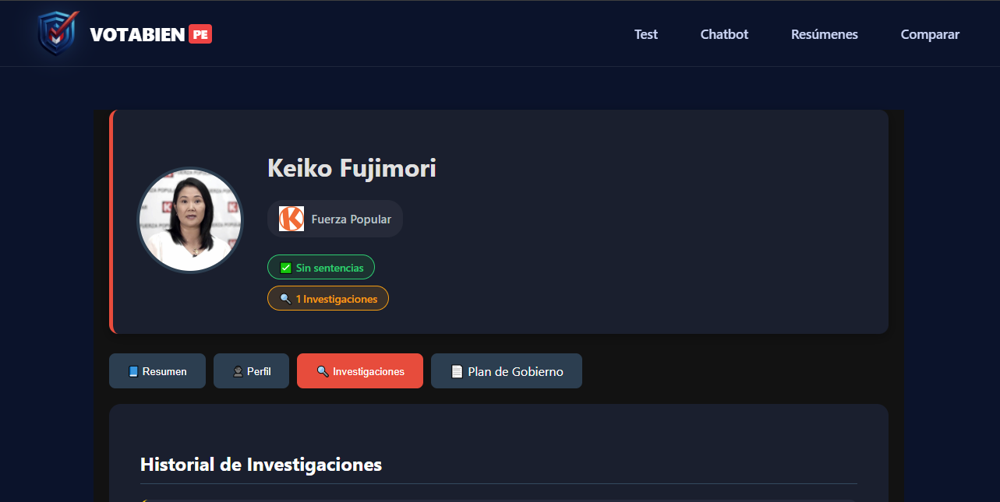
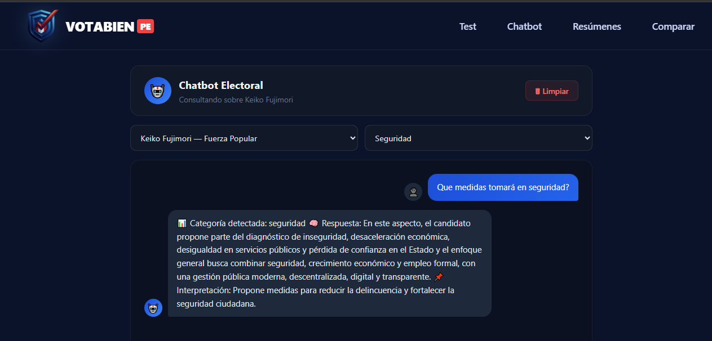

# VotaBienPe - Frontend 🖥️🗳️


Interfaz de usuario moderna y responsiva diseñada para empoderar al ciudadano peruano. La plataforma permite interactuar con datos electorales complejos a través de una experiencia intuitiva, facilitando el voto informado mediante **Inteligencia Artificial** y visualización de datos de alto impacto.

---

## 🚀 Funcionalidades Clave

| Característica | Descripción y Detalle Técnico |
| :--- | :--- |
| **📝 Test de Alineamiento** | Interfaz dinámica de 12 preguntas que categoriza la postura del usuario en temas críticos. |
| **🤖 Chatbot Electoral** | Chat interactivo (`Chatbot.tsx`) que extrae respuestas exclusivas de los planes de gobierno. |
| **📈 Comparador Inteligente** | Herramienta visual que usa `RadarChartCompare.tsx` para mostrar porcentajes de coincidencia. |
| **🗂️ Dashboard de Candidatos** | Visualización de perfiles, resúmenes ejecutivos y acceso directo a planes de gobierno en PDF. |
| **🔍 Buscador Avanzado** | Filtros inteligentes por partido, región y antecedentes éticos. |
| **✉️ Centro de Feedback** | Formularios integrados para reporte de errores y contacto directo con el equipo. |

---

## 🛠️ Stack Tecnológico

* **Framework Core:** React 18 con Hooks para una gestión de estado eficiente.
* **Tipado:** TypeScript para garantizar un desarrollo robusto y escalable.
* **Build Tool:** Vite (Optimización de carga y HMR ultra rápido).
* **Estilos:** Bootstrap para un diseño limpio y 100% adaptable.
* **Gráficos:** Recharts / Chart.js para la representación de KPIs y radar político.
* **Comunicación:** Axios / Fetch API conectado al backend en **Java 21 / Spring Boot**.

---

## 📸 Capturas de Pantalla (Preview)

Aquí puedes ver la interfaz en funcionamiento:

| 🧪 Test de Afinidad | 📊 Resúmenes | 🤖 Chatbot IA |
| :---: | :---: | :---: |
|  |  |  |

---

## 📂 Estructura del Proyecto

```text
src/
 ├── 📂 assets/          # Recursos visuales e imágenes de capturas.
 ├── 📂 components/      # Componentes modulares (Navbar, RadarChart).
 ├── 📂 pages/           # Vistas principales (Chatbot, Encuesta, Comparativa).
 ├── 📂 services/        # Capa de servicios para consumo de API (api.ts).
 ├── 📂 types/           # Definición de interfaces y tipos de TypeScript.
 └── 📂 utils/           # Funciones de ayuda y lógica de formateo.
```

---

## ⚙️ Configuración e Instalación

Sigue estos pasos para levantar el entorno de desarrollo localmente.

### ✅ Requisitos Previos

Antes de iniciar, asegúrate de tener instalado lo siguiente:

- 🟢 **Node.js** `v18` o superior  
- 📦 **npm** o **yarn**  
- 🌐 Navegador moderno (Chrome, Edge, Firefox)  
- ☕ Backend de **Spring Boot** en ejecución

---

## 📥 Instalación del Proyecto

### 1️⃣ Clonar el Repositorio

```bash
git clone https://github.com/tu-usuario/votabienpe-frontend.git
cd votabienpe-frontend
```

### 2️⃣ Instalar Dependencias

```bash
npm install
```

### 3️⃣ Variables de Entorno

Crea un archivo `.env` en la raíz del proyecto y agrega la URL del backend:

```env
VITE_API_URL=http://localhost:8080/api
```

### 4️⃣ Iniciar el Servidor de Desarrollo

```bash
npm run dev
```

> [!TIP]
> La aplicación estará disponible por defecto en: http://localhost:5173

---

## 🤝 Feedback y Transparencia

El proyecto incluye secciones dedicadas a la **Transparencia**, permitiendo a los usuarios reportar errores en la data electoral o sugerir mejoras técnicas. Creemos en la tecnología como herramienta de fiscalización ciudadana.

> [!IMPORTANT]
> **Dependencia del Backend:** Asegúrate de tener el repositorio `vota-bien-pe-backend` en ejecución para que el Test de Afinidad y el Chatbot puedan procesar los datos correctamente.

---

## 👨‍💻 Autor

Desarrollado por **Julio Edson Castillo Ita**  
Proyecto enfocado en democracia digital e inteligencia artificial aplicada al voto informado en Perú.

---

## 📄 Licencia

Este proyecto está bajo la Licencia MIT. Consulta el archivo `LICENSE` para más detalles.
